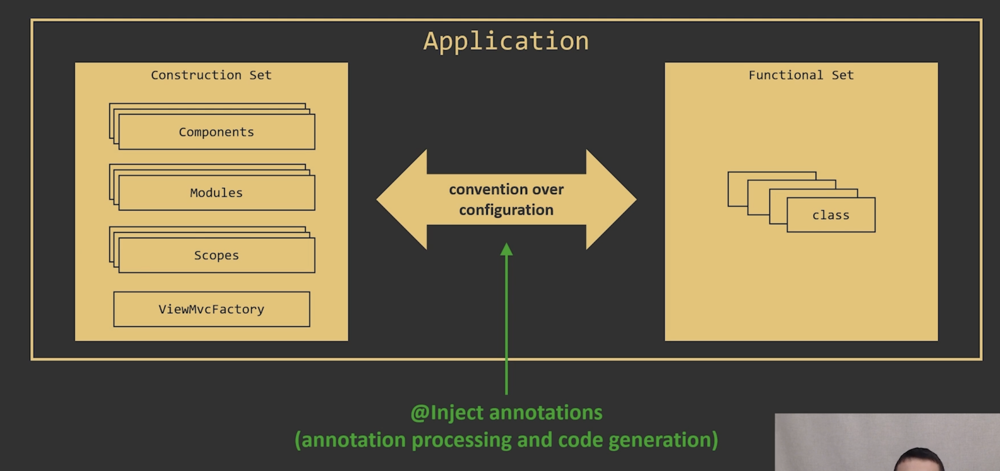

# Dagger Tutorial

### Relevant Repository

[https://github.com/paigeshin/PureDependencyInjection](https://github.com/paigeshin/PureDependencyInjection)

[https://github.com/techyourchance/course-android-dependency-injection-with-dagger-2](https://github.com/techyourchance/course-android-dependency-injection-with-dagger-2)

Recommended Structure ⇒ [https://github.com/paigeshin/DependencyInjectionWithDagger/tree/1da15c90fefbeb1cfaf85c3e4aaa57c7f7c69c30](https://github.com/paigeshin/DependencyInjectionWithDagger/tree/1da15c90fefbeb1cfaf85c3e4aaa57c7f7c69c30)

### Whole Process for Dagger

1. Create Modules

   - Modules
   - Scopes
   - Components

2. Create Components

   ⇒ Client should never access to `Modules` but through `Components`

   - Subcomponent
   - Multiple Modules

# v.0.0.1

### Gradle Configuration

[https://github.com/google/dagger](https://github.com/google/dagger)

- Application Level Gradle

```kotlin
apply plugin: 'com.android.application'
apply plugin: 'kotlin-android'
apply plugin: 'kotlin-android-extensions'
apply plugin: 'kotlin-kapt'

android {
    compileSdkVersion 29
    defaultConfig {
        applicationId "com.techyourchance.dagger2course"
        minSdkVersion 19
        targetSdkVersion 29
        versionCode 1
        versionName "1.0"
        vectorDrawables.useSupportLibrary = true
    }
    buildTypes {
        release {
            minifyEnabled false
            proguardFiles getDefaultProguardFile('proguard-android.txt'), 'proguard-rules.pro'
        }
    }
    compileOptions {
        sourceCompatibility = 1.8
        targetCompatibility = 1.8
    }
}

dependencies {
    implementation fileTree(dir: 'libs', include: ['*.jar'])

    implementation "org.jetbrains.kotlin:kotlin-stdlib-jdk7:$kotlin_version"

    //DI
    api 'com.google.dagger:dagger:$dagger_version'
    kapt 'com.google.dagger:dagger-compiler:$dagger_version'

    implementation 'androidx.appcompat:appcompat:1.1.0'
    implementation 'androidx.recyclerview:recyclerview:1.1.0'
    implementation 'androidx.swiperefreshlayout:swiperefreshlayout:1.0.0'

    implementation 'com.squareup.retrofit2:retrofit:2.6.1'
    implementation 'com.squareup.retrofit2:converter-gson:2.6.1'

    implementation 'org.jetbrains.kotlinx:kotlinx-coroutines-core:1.3.7'
    implementation 'org.jetbrains.kotlinx:kotlinx-coroutines-android:1.3.7'
}
```

### Module & Provides

- It should not be `properties` but rather `function`

### Pure Dependency Injection

- PresentationCompositionRoot.kt

```kotlin
class PresentationCompositionRoot(private val activityCompositionRoot: ActivityCompositionRoot) {

    private val layoutInflater get() = activityCompositionRoot.layoutInflater

    private val fragmentManager get() = activityCompositionRoot.fragmentManager

    private val stackoverflowApi get() = activityCompositionRoot.stackoverflowApi

    private val activity get() = activityCompositionRoot.activity

    val screensNavigator get() = activityCompositionRoot.screensNavigator

    val viewMvcFactory get() = ViewMvcFactory(layoutInflater)

    val dialogsNavigator get() = DialogsNavigator(fragmentManager)

    val fetchQuestionsUseCase get() = FetchQuestionsUseCase(stackoverflowApi)

    val fetchQuestionDetailsUseCase get() = FetchQuestionDetailsUseCase(stackoverflowApi)

}
```

### with Dagger

- PresentationModule.kt

```kotlin
@Module
class PresentationModule(private val activityCompositionRoot: ActivityCompositionRoot) {

    @Provides
    fun layoutInflater() = activityCompositionRoot.layoutInflater

    @Provides
    fun fragmentManager() = activityCompositionRoot.fragmentManager

    @Provides
    fun stackoverflowApi() = activityCompositionRoot.stackoverflowApi

    @Provides
    fun activity() = activityCompositionRoot.activity

    @Provides
    fun screenNavigator() = activityCompositionRoot.screensNavigator

    @Provides
    fun viewMvcFactory(layoutInflater: LayoutInflater) = ViewMvcFactory(layoutInflater)

    @Provides
    fun dialogsNavigator(fragmentManager: FragmentManager) = DialogsNavigator(fragmentManager)

    @Provides
    fun fetchQuestionsUseCase(stackoverflowApi: StackoverflowApi) = FetchQuestionsUseCase(stackoverflowApi)

    @Provides
    fun fetchQuestionDetailsUseCase(stackoverflowApi: StackoverflowApi) = FetchQuestionDetailsUseCase(stackoverflowApi)

}
```

### Decide what to expose to clients

- PresentationComponent.kt
- Rule number 1 when using dagger

  ⇒ You should never talk to `Module` directly but through `Components`

```kotlin
@Component(modules = [PresentationModule::class])
interface PresentationComponent {

    fun screenNavigator(): ScreensNavigator

    fun viewMvcFactory(): ViewMvcFactory

    fun dialogsNavigator(): DialogsNavigator

    fun fetchQuestionsUseCase(): FetchQuestionsUseCase

    fun fetchQuestionDetailsUseCase(): FetchQuestionDetailsUseCase

}
```

### Now app looks like


### Dagger Conventions

- Components are interfaces annotated with @Component
- Modules are classes annotated with @Module
- Methods in modules that provide services are annotated with @Provides
- Provided services can be used as method in other provider methods

### What I learned from verion 0.0.1

- Dagger are composed of two components
  - Module (@Module, @Provider) => To define what services to be exposed
  - Component (@Compoment(modules = [ModuleContinaer::class])) => To use services
- Instantiation of Dagger
  ```kotlin
    val appComponent: AppComponent by lazy {
      DaggerAppComponent.builder()
        .appModule(AppModule(this))
        .build()
    }
  ```
  - All dagger components properties take shape of function

# V.0.0.2

### Scope in Dagger2

- This service should be instantiated lazily the first time it's required

```kotlin
class ActivityModule(val activity: AppCompatActivity, private val appComponent: AppComponent) {
    private val screensNavigator by lazy {
        ScreensNavigator(activity)
    }
		@Provides
    fun screensNavigator(activity: AppCompatActivity) = ScreensNavigator(activity)
}

```

```kotlin
@Scope
annotation class ActivityScope {

}
class ActivityModule(val activity: AppCompatActivity, private val appComponent: AppComponent) {
		@Provides
		@ActivityScope
    fun screensNavigator(activity: AppCompatActivity) = ScreensNavigator(activity)
}

@ActivityScope
@Component(modules = [ActivityModule::class])
interface ActivityComponent {
    fun activity(): AppCompatActivity
    fun layoutInflater(): LayoutInflater
    fun fragmentManager(): FragmentManager
    fun stackoverflowApi(): StackoverflowApi
    fun screensNavigator(): ScreensNavigator
}
```

⇒ ActivityScope is essentially `Singleton` , but singleton here doesn't mean `Singleton across the whole application`

⇒ All clients get the same instance of a scoped service **from the same instance** of a Component

### Singleton Scope (DefaultScope)

- singleton here doesn't mean `Singleton across the whole application`

- **Before refactoring**

```kotlin
@Module
class AppModule(val application: Application) {

    private val retrofit: Retrofit by lazy {
        Retrofit.Builder()
                .baseUrl(Constants.BASE_URL)
                .addConverterFactory(GsonConverterFactory.create())
                .build()
    }

    private val stackoverflowApi: StackoverflowApi by lazy {
        retrofit.create(StackoverflowApi::class.java)
    }

    @Provides
    fun application() = application

    @Provides
    fun stackoverflowApi() = stackoverflowApi

}
```

- **After refactoring**

```kotlin
@Module
class AppModule(val application: Application) {

    @Provides
    @Singleton
    fun retrofit(): Retrofit {
        return Retrofit.Builder()
                .baseUrl(Constants.BASE_URL)
                .addConverterFactory(GsonConverterFactory.create())
                .build()
    }

    @Provides
    fun application() = application

    // This is not recommended way
    // When working with Dagger2 and you need some dependency, provide it as arguments
    // calling retrofit() can create new instance.. but here we marked retrofit as singleton so it will work even if we put it this way
    // However, recommended way when working with Dagger2, provided needed dependency with `arguments`
    /*
        @Singleton
        @Provides
        fun stackoverflowApi() = retrofit().create(StackoverflowApi::class.java)
     */

    //Correct Way
    @Singleton
    @Provides
    fun stackoverflowApi(retrofit: Retrofit) = retrofit.create(StackoverflowApi::class.java)

}
```

### How to pass desired object in dagger2

- **Wrong Code example**

```kotlin
@Module
class AppModule(val application: Application) {

    @Provides
    @Singleton
    fun retrofit(): Retrofit {
        return Retrofit.Builder()
                .baseUrl(Constants.BASE_URL)
                .addConverterFactory(GsonConverterFactory.create())
                .build()
    }

    @Provides
    fun application() = application

    @Singleton
    @Provides
    fun stackoverflowApi() = retrofit().create(StackoverflowApi::class.java)
}
```

⇒ This is not recommended way

⇒ When working with Dagger2 and need some dependency, provide it as arguments.

⇒ Calling directly retrofit() can create new instance.. but here we marked retrofit as singleton so it will work even if we put it this way

⇒ However, recommended way when working with Dagger2, provided needed dependency with function `arguments`

- **Right way to write dagger code**

```kotlin
@Module
class AppModule(val application: Application) {

    @Provides
    @Singleton
    fun retrofit(): Retrofit {
        return Retrofit.Builder()
                .baseUrl(Constants.BASE_URL)
                .addConverterFactory(GsonConverterFactory.create())
                .build()
    }

    @Provides
    fun application() = application

     //Correct Way
    @Singleton
    @Provides
    fun stackoverflowApi(retrofit: Retrofit) = retrofit.create(StackoverflowApi::class.java)
}
```

### Dagger Conventions (2):

- Scopes are annotations, annotated with @Scope
- Components that provide scoped services must be scoped
- All clients get the same instance of a scoped service **from the same instance** of a Component

# V.0.0.3, Component as Injector

### Refactoring

- Custom Injector
- Injector.kt

⇒ We will remove this.

```kotlin
package com.techyourchance.dagger2course.common.dependnecyinjection

import com.techyourchance.dagger2course.common.dependnecyinjection.presentation.PresentationComponent
import com.techyourchance.dagger2course.questions.FetchQuestionDetailsUseCase
import com.techyourchance.dagger2course.questions.FetchQuestionsUseCase
import com.techyourchance.dagger2course.screens.common.ScreensNavigator
import com.techyourchance.dagger2course.screens.common.dialogs.DialogsNavigator
import com.techyourchance.dagger2course.screens.common.viewsmvc.ViewMvcFactory
import java.lang.reflect.Field

class Injector(private val component: PresentationComponent) {

    fun inject(client: Any) {
        for (field in getAllFields(client)) {
            if (isAnnotatedForInjection(field)) {
                injectField(client, field)
            }
        }
    }

    private fun getAllFields(client: Any): Array<out Field> {
        val clientClass = client::class.java
        return clientClass.declaredFields
    }

    private fun isAnnotatedForInjection(field: Field): Boolean {
        val fieldAnnotations = field.annotations
        for (annotation in fieldAnnotations) {
            if (annotation is Service) {
                return true
            }
        }
        return false
    }

    private fun injectField(client: Any, field: Field) {
        val isAccessibleInitially = field.isAccessible
        field.isAccessible = true
        field.set(client, getServiceForClass(field.type))
        field.isAccessible = isAccessibleInitially
    }

    private fun getServiceForClass(type: Class<*>): Any {
        when (type) {
            DialogsNavigator::class.java -> {
                return component.dialogsNavigator()
            }
            ScreensNavigator::class.java -> {
                return component.screensNavigator()
            }
            FetchQuestionsUseCase::class.java -> {
                return component.fetchQuestionsUseCase()
            }
            FetchQuestionDetailsUseCase::class.java -> {
                return component.fetchQuestionDetailsUseCase()
            }
            ViewMvcFactory::class.java -> {
                return component.viewMvcFactory()
            }
            else -> {
                throw Exception("unsupported service type: $type")
            }
        }
    }

}
```

- PresentationComponent.kt

⇒ Delete all methods and add a new method

```kotlin
@Component(modules = [PresentationModule::class])
interface PresentationComponent {
//    fun screensNavigator(): ScreensNavigator
//    fun viewMvcFactory(): ViewMvcFactory
//    fun dialogsNavigator(): DialogsNavigator
//    fun fetchQuestionsUseCase(): FetchQuestionsUseCase
//    fun fetchQuestionDetailsUseCase(): FetchQuestionDetailsUseCase
    fun inject(fragment: QuestionsListFragment)
    fun inject(activity: QuestionDetailsActivity)
}
```

❗️How would my client (QuestionsListFragment here) knows all the necessary dependencies are injected?

- BaseFragment.kt

```kotlin
open class BaseFragment: Fragment() {

    private val presentationComponent: PresentationComponent by lazy {
        DaggerPresentationComponent.builder()
                .presentationModule(PresentationModule((requireActivity() as BaseActivity).activityComponent))
                .build()
    }

//    protected val injector get() = Injector(presentationComponent)
    protected val injector get() = presentationComponent
}
```

- BaseActivty.kt

```kotlin
package com.techyourchance.dagger2course.screens.common.activities

import androidx.appcompat.app.AppCompatActivity
import com.techyourchance.dagger2course.MyApplication
import com.techyourchance.dagger2course.common.dependnecyinjection.*
import com.techyourchance.dagger2course.common.dependnecyinjection.activity.ActivityModule
import com.techyourchance.dagger2course.common.dependnecyinjection.activity.DaggerActivityComponent
import com.techyourchance.dagger2course.common.dependnecyinjection.presentation.DaggerPresentationComponent
import com.techyourchance.dagger2course.common.dependnecyinjection.presentation.PresentationComponent
import com.techyourchance.dagger2course.common.dependnecyinjection.presentation.PresentationModule

open class BaseActivity: AppCompatActivity() {

    private val appComponent get() = (application as MyApplication).appComponent

    val activityComponent by lazy {
        DaggerActivityComponent.builder()
                .activityModule(ActivityModule(this, appComponent))
                .build()
    }

    private val presentationComponent: PresentationComponent by lazy {
        DaggerPresentationComponent.builder()
                .presentationModule(PresentationModule(activityComponent))
                .build()
    }

//    protected val injector get() = Injector(presentationComponent)
    protected val injector get() = presentationComponent

}
```

- QuestionsListFragment.kt - client

```kotlin
package com.techyourchance.dagger2course.screens.questionslist

import android.os.Bundle
import android.view.LayoutInflater
import android.view.View
import android.view.ViewGroup
import com.techyourchance.dagger2course.common.dependnecyinjection.Service
import com.techyourchance.dagger2course.questions.FetchQuestionsUseCase
import com.techyourchance.dagger2course.questions.Question
import com.techyourchance.dagger2course.screens.common.ScreensNavigator
import com.techyourchance.dagger2course.screens.common.dialogs.DialogsNavigator
import com.techyourchance.dagger2course.screens.common.fragments.BaseFragment
import com.techyourchance.dagger2course.screens.common.viewsmvc.ViewMvcFactory
import kotlinx.coroutines.*
import javax.inject.Inject

class QuestionsListFragment : BaseFragment(), QuestionsListViewMvc.Listener {

    private val coroutineScope = CoroutineScope(SupervisorJob() + Dispatchers.Main.immediate)

    @Inject lateinit var fetchQuestionsUseCase: FetchQuestionsUseCase
    @Inject lateinit var dialogsNavigator: DialogsNavigator
    @Inject lateinit var screensNavigator: ScreensNavigator
    @Inject lateinit var viewMvcFactory: ViewMvcFactory

    private lateinit var viewMvc: QuestionsListViewMvc

    private var isDataLoaded = false

    override fun onCreate(savedInstanceState: Bundle?) {
        injector.inject(this)
        super.onCreate(savedInstanceState)
    }

    override fun onCreateView(inflater: LayoutInflater, container: ViewGroup?, savedInstanceState: Bundle?): View? {
        viewMvc = viewMvcFactory.newQuestionsListViewMvc(container)
        return viewMvc.rootView
    }

    override fun onStart() {
        super.onStart()
        viewMvc.registerListener(this)
        if (!isDataLoaded) {
            fetchQuestions()
        }
    }

    override fun onStop() {
        super.onStop()
        coroutineScope.coroutineContext.cancelChildren()
        viewMvc.unregisterListener(this)
    }

    override fun onRefreshClicked() {
        fetchQuestions()
    }

    private fun fetchQuestions() {
        coroutineScope.launch {
            viewMvc.showProgressIndication()
            try {
                val result = fetchQuestionsUseCase.fetchLatestQuestions()
                when (result) {
                    is FetchQuestionsUseCase.Result.Success -> {
                        viewMvc.bindQuestions(result.questions)
                        isDataLoaded = true
                    }
                    is FetchQuestionsUseCase.Result.Failure -> onFetchFailed()
                }
            } finally {
                viewMvc.hideProgressIndication()
            }
        }
    }

    private fun onFetchFailed() {
        dialogsNavigator.showServerErrorDialog()
    }

    override fun onQuestionClicked(clickedQuestion: Question) {
        screensNavigator.toQuestionDetails(clickedQuestion.id)
    }

}
```

- Dependency Injection Convention

```kotlin
@Component(modules = [PresentationModule::class])
interface PresentationComponent {
    fun inject(fragment: QuestionsListFragment)
    fun inject(activity: QuestionDetailsActivity)
}
```

- Look at these properties in client.

```kotlin
@Inject lateinit var fetchQuestionsUseCase: FetchQuestionsUseCase
@Inject lateinit var dialogsNavigator: DialogsNavigator
@Inject lateinit var screensNavigator: ScreensNavigator
@Inject lateinit var viewMvcFactory: ViewMvcFactory

override fun onCreate(savedInstanceState: Bundle?) {
    injector.inject(this)
    super.onCreate(savedInstanceState)
}
```

⇒ All of these dependencies are automatically injected

### Dependency injection Convention

```kotlin
@Component(modules = [PresentationModule::class])
interface PresentationComponent {
    fun inject(fragment: QuestionsListFragment)
    fun inject(activity: QuestionDetailsActivity)
}
```

❗️How would my client (QuestionsListFragment here) knows all the necessary dependencies are injected?

⇒ This is just dependency injection convention. By declaring interface with @Component, and functions, it automatically injects all the necessary dependencies defined in `Module`

⇒ Here, Dagger auto-generates code

### What is the whole purpose of this?

- Remove Injector
- Our clients is given access to Component directly not through injector

### Before refactoring


### After refactoring


### Dagger Conventions (3):

- Void methods with single argument defined on components generate injectors for the type of the argument

```kotlin
@Component(modules = [PresentationModule::class])
interface PresentationComponent {
    fun inject(fragment: QuestionsListFragment)
    fun inject(activity: QuestionDetailsActivity)
}
```

- Client's non-private non-final properties (fields) annotated with @Inject designate injection targets

```kotlin
@Inject lateinit var fetchQuestionsUseCase: FetchQuestionsUseCase
@Inject lateinit var dialogsNavigator: DialogsNavigator
@Inject lateinit var screensNavigator: ScreensNavigator
@Inject lateinit var viewMvcFactory: ViewMvcFactory

override fun onCreate(savedInstanceState: Bundle?) {
    injector.inject(this)
    super.onCreate(savedInstanceState)
}
```

# v.0.0.4 - Dependent Components

### Refactoring PresentationModule.kt

- Before refactoring

```kotlin
@Module
class PresentationModule(private val activityComponent: ActivityComponent) {
    @Provides
    fun layoutInflater() = activityComponent.layoutInflater()
    @Provides
    fun fragmentManager() = activityComponent.fragmentManager()
    @Provides
    fun stackoverflowApi() = activityComponent.stackoverflowApi()
    @Provides
    fun activity() = activityComponent.activity()
    //실제 사용.
    @Provides
    fun screensNavigator() = activityComponent.screensNavigator()
    @Provides
    fun viewMvcFactory(layoutInflater: LayoutInflater) = ViewMvcFactory(layoutInflater)
    @Provides
    fun dialogsNavigator(fragmentManager: FragmentManager) = DialogsNavigator(fragmentManager)
    @Provides
    fun fetchQuestionsUseCase(stackoverflowApi: StackoverflowApi) = FetchQuestionsUseCase(stackoverflowApi)
    @Provides
    fun fetchQuestionDetailsUseCase(stackoverflowApi: StackoverflowApi) = FetchQuestionDetailsUseCase(stackoverflowApi)
}
```

- After refactoring

```kotlin
@Module
class PresentationModule() {
    @Provides
    fun viewMvcFactory(layoutInflater: LayoutInflater) = ViewMvcFactory(layoutInflater)
    @Provides
    fun dialogsNavigator(fragmentManager: FragmentManager) = DialogsNavigator(fragmentManager)
    @Provides
    fun fetchQuestionsUseCase(stackoverflowApi: StackoverflowApi) = FetchQuestionsUseCase(stackoverflowApi)
    @Provides
    fun fetchQuestionDetailsUseCase(stackoverflowApi: StackoverflowApi) = FetchQuestionDetailsUseCase(stackoverflowApi)
}
```

⇒ All dependencies come from `ActivityComponent`

### Refactoring PresentationComponent.kt

- Before refactoring

```kotlin
@Component(modules = [PresentationModule::class])
interface PresentationComponent {
    fun inject(fragment: QuestionsListFragment)
    fun inject(activity: QuestionDetailsActivity)
}
```

- After refactoring

```kotlin
@PresentationScope
@Component(dependencies = [ActivityComponent::class], modules = [PresentationModule::class])
interface PresentationComponent {
    fun inject(fragment: QuestionsListFragment)
    fun inject(activity: QuestionDetailsActivity)
}
```

⇒ Component has an explicit dependency declaration of `ActivityComponent::class`

### Inject dependencies

- Before refactoring

```kotlin
DaggerPresentationComponent.builder()
                .presentationModule(PresentationModule(activityComponent))
                .build()
```

- After refactoring

```kotlin
DaggerPresentationComponent.builder()
        .activityComponent(activityComponent)
        .presentationModule(PresentationModule())
        .build()
```

### Dagger Convention (4):

- Component inter-dependencies are specified as part of @Component annotation
- Component B that depends on Component A has implicit access to all services exposed by Component A
  - Services from A can be injected by B
  - Services from A can be consumed inside modules of B

# v.0.0.5 - Subcomponent

### Refactoring Presentation Component

```kotlin
@PresentationScope
@Subcomponent(modules = [PresentationModule::class])
interface PresentationComponent {
    fun inject(fragment: QuestionsListFragment)
    fun inject(activity: QuestionDetailsActivity)
}

//@PresentationScope
//@Component(dependencies = [ActivityComponent::class], modules = [PresentationModule::class])
//interface PresentationComponent {
//    fun inject(fragment: QuestionsListFragment)
//    fun inject(activity: QuestionDetailsActivity)
//}
```

⇒ Make it subcomponent

⇒ This simply means component here delegates its dependency injection to parent component

### Refactoring Activity Component

```kotlin
@ActivityScope
@Component(dependencies = [AppComponent::class], modules = [ActivityModule::class])
interface ActivityComponent {
    fun newPresentationComponent(presentationModule: PresentationModule): PresentationComponent
}

//@ActivityScope
//@Component(dependencies = [AppComponent::class], modules = [ActivityModule::class])
//interface ActivityComponent {
//    fun activity(): AppCompatActivity
//    fun layoutInflater(): LayoutInflater
//    fun stackoverflowApi(): StackoverflowApi
//    fun fragmentManager(): FragmentManager
//    fun screensNavigator(): ScreensNavigator
//}
```

⇒ ActivityComponent will expose `PresentationComponent`

### Initialization

```kotlin
private val presentationComponent: PresentationComponent by lazy {
        activityComponent.newPresentationComponent(PresentationModule())
//        DaggerPresentationComponent.builder()
//                .activityComponent(activityComponent)
//                .presentationModule(PresentationModule())
//                .build()
  }
```

### Dagger Conventions (5):

- Subcomponents specified by @Subcomponent annotation
- Parent Component exposes factory method which returns Subcomponent
- The argument of the factory method are Subcomponent's modules
- Subcomponents get access to all services provided by parent (provided, not just exposed)

# v.0.0.6 - Multi-module components

### Base Example

```kotlin
@PresentationScope
@Subcomponent(modules = [PresentationModule::class, UsecasesModule::class])
interface PresentationComponent {
    fun inject(fragment: QuestionsListFragment)
    fun inject(activity: QuestionDetailsActivity)
}

@Module
class PresentationModule() {
    @Provides
    fun viewMvcFactory(layoutInflater: LayoutInflater) = ViewMvcFactory(layoutInflater)
    @Provides
    fun dialogsNavigator(fragmentManager: FragmentManager) = DialogsNavigator(fragmentManager)
}

@Module
class UsecasesModule {
    @Provides
    fun fetchQuestionsUseCase(stackoverflowApi: StackoverflowApi) = FetchQuestionsUseCase(stackoverflowApi)
    @Provides
    fun fetchQuestionDetailsUseCase(stackoverflowApi: StackoverflowApi) = FetchQuestionDetailsUseCase(stackoverflowApi)
}
```

### Bootstrapping Dependency

```kotlin
@Module    //argument `activity` is called bootstrapping dependency, which you can only get when running application
class ActivityModule(val activity: AppCompatActivity) {

    @Provides
    fun activity() = activity

    @Provides
    @ActivityScope
    fun screensNavigator(activity: AppCompatActivity) = ScreensNavigator(activity)

    @Provides
    fun layoutInflater() = LayoutInflater.from(activity)

    @Provides
    fun fragmentManager() = activity.supportFragmentManager

}
```

⇒ argument `activity` is called bootstrapping dependency, which you can only get from exterior module

### Refactoring ActivityComponent

- ActivityComponent before refactoring

```kotlin
@ActivityScope
@Subcomponent(modules = [ActivityModule::class])
interface ActivityComponent {
    //You don't need to pass `presentationModule` when it doesn't have any bootstrapping dependency
    fun newPresentationComponent(presentationModule: PresentationModule): PresentationComponent
}
```

- ActivityComponent after refactoring

```kotlin
@ActivityScope
@Subcomponent(modules = [ActivityModule::class])
interface ActivityComponent {
    //You don't need to pass `presentationModule` when it doesn't have any bootstrapping dependency
    fun newPresentationComponent(): PresentationComponent
}
```

⇒ This is possible because dagger has this convention and it knows how to instantiate objects without constructors

⇒ Provide no argument when there isn't a bootstrapping argument

### Best way to define subcomponent

```kotlin
package com.techyourchance.dagger2course.common.dependnecyinjection.activity

import com.techyourchance.dagger2course.common.dependnecyinjection.presentation.PresentationComponent
import com.techyourchance.dagger2course.common.dependnecyinjection.presentation.PresentationModule
import com.techyourchance.dagger2course.common.dependnecyinjection.presentation.UsecasesModule
import dagger.Subcomponent

@ActivityScope
@Subcomponent(modules = [ActivityModule::class])
interface ActivityComponent {
    //You don't need to pass `presentationModule` when it doesn't have any bootstrapping dependency
    fun newPresentationComponent(presentationModule: PresentationModule, usecasesModule: UsecasesModule): PresentationComponent
}
```

⇒ Even if `PresentationModule` and `UsecaseModule` doesn't have any bootstrapping dependency, it's best to provide arguments for convention and code maintenance

### Dagger Conventions (6)

- Components can use more than one module
- Modules of a single Component share the same object graph
- Dagger automatically instantiates modules when no-argument constructors

# v.0.0.7 - Automatic Discover of Services

⇒ Not recommended, but just be aware that this exists.

⇒ Explicitly define modules.

### Dialogs Navigator

```kotlin
class DialogsNavigator @Inject constructor(private val fragmentManager: FragmentManager) {

    fun showServerErrorDialog() {
        fragmentManager.beginTransaction()
                .add(ServerErrorDialogFragment.newInstance(), null)
                .commitAllowingStateLoss()
    }
}
```

### PresentationModule

```kotlin

@Module
class PresentationModule() {
    @Provides
    fun viewMvcFactory(layoutInflater: LayoutInflater) = ViewMvcFactory(layoutInflater)
//    @Provides
//    fun dialogsNavigator(fragmentManager: FragmentManager) = DialogsNavigator(fragmentManager)
}
```

### How is this possible?

1. PresentationComponent is subcomponent of ActivityComponent
2. Inside of ActivityModule, we can find `fun fragmentManager()`
3. So it will find where `fragmentManger` is needed

```kotlin

@Module//argument `activity` is called bootstrapping dependency, which you can only get when running application
class ActivityModule(val activity: AppCompatActivity) {

    @Provides
    fun activity() = activity

    @Provides
    @ActivityScope
    fun screensNavigator(activity: AppCompatActivity) = ScreensNavigator(activity)

    @Provides
    fun layoutInflater() = LayoutInflater.from(activity)

    @Provides
    fun fragmentManager() = activity.supportFragmentManager

}

```

```kotlin
package com.techyourchance.dagger2course.screens.common.dialogs

import androidx.fragment.app.FragmentManager
import javax.inject.Inject

class DialogsNavigator @Inject constructor(private val fragmentManager: FragmentManager) {

    fun showServerErrorDialog() {
        fragmentManager.beginTransaction()
                .add(ServerErrorDialogFragment.newInstance(), null)
                .commitAllowingStateLoss()
    }
}
```

### Scoped Component automatic injection

```kotlin
@Module    //argument `activity` is called bootstrapping dependency, which you can only get when running application
class ActivityModule(val activity: AppCompatActivity) {

    @Provides
    fun activity() = activity

//    @Provides
//    @ActivityScope
//    fun screensNavigator(activity: AppCompatActivity) = ScreensNavigator(activity)

    @Provides
    fun layoutInflater() = LayoutInflater.from(activity)

    @Provides
    fun fragmentManager() = activity.supportFragmentManager

}@ActivityScope
class DialogsNavigator @Inject constructor(private val fragmentManager: FragmentManager) {

    fun showServerErrorDialog() {
        fragmentManager.beginTransaction()
                .add(ServerErrorDialogFragment.newInstance(), null)
                .commitAllowingStateLoss()
    }
}
```

### Dagger Conventions(7)

- Dagger can automatically discover services having a public constructor annotated with @Inject annotation
- Automatically discovered services can be scoped

# Summary



- Modules
- Scopes
- Components
